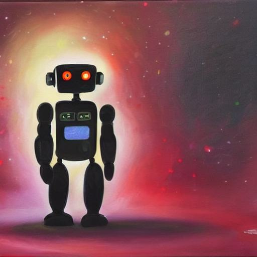
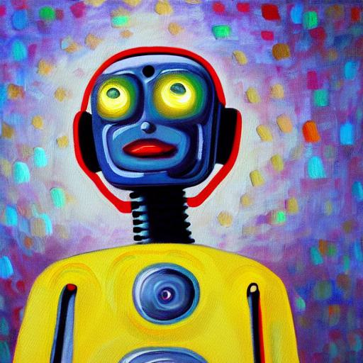
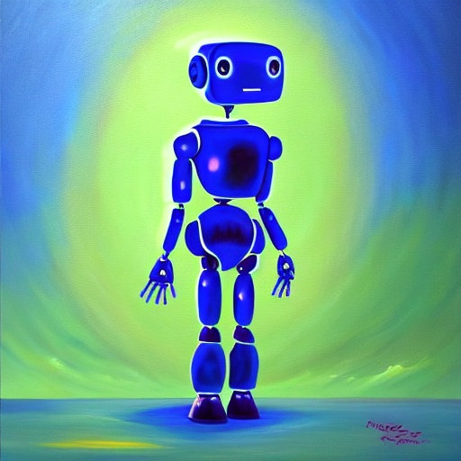
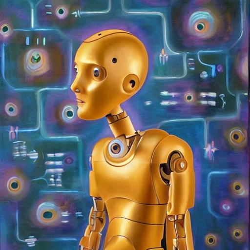
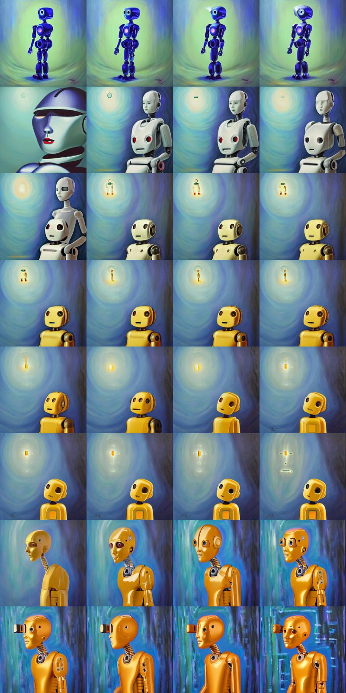

## Stable Diffusion Playground | 💻 + 🎨 = ❤️

Welcome to stable diffusion playground! Use this repo to generate cool images!

Also - you get reproducibility for free! You'll know exactly how you created all of your images.

The metadata and latent information is stored inside of the image and into a npy file respectively.

Here are some images I generated using the prompt: `a painting of an ai robot having an epiphany moment`:

If you generate something cool, tag me on Twitter 🐦 [@gordic_aleksa](https://twitter.com/gordic_aleksa) - I'd love to see what you create.
    
## Setup

Follow the next steps to run this code:

1. `git clone https://github.com/gordicaleksa/stable_diffusion_playground`
2. Open Anaconda console and navigate into project directory `cd path_to_repo`
3. Run `conda env create` from project directory (this will create a brand new conda environment).
4. Run `activate sd_playground` (for running scripts from your console or setup the interpreter in your IDE)
5. Run `huggingface-cli login` before the first time you try to use it to access model weights.

That's it! It should work out-of-the-box executing environment.yml file which deals with dependencies.  

**Important note:** you have to locally patch the `pipeline_stable_diffusion.py` file from the `diffusers 0.2.4` lib
using the code from the [main](https://github.com/huggingface/diffusers/blob/main/src/diffusers/pipelines/stable_diffusion/pipeline_stable_diffusion.py) branch. The changes I rely (having `latents` as an argument) on still haven't propagated to the pip package.

## How to use this code

The script can be run using an `IDE` (such as vscode, PyCharm, etc.) but it can also be run via `command line` thanks to `fire` package. `fire` makes things much more concise than using `argparse`! E.g. if there is an argument in the `generate_images` function with name `<arg_name>` then you can call `python generate_images.py --<arg_name> <arg_value>`.

Next up - a brief explanation of certain script arguments.

`output_dir_name` is the name of the output directory. 
* Your images will be stored at `output/<output_dir_name>/imgs`.
* Your latents will be stored at `output/<output_dir_name>/latents`.
* Your metadata will be stored inside of the `user_comment` exif tag if `save_metadata_to_img`==`True` otherwise it'll be saved to `output/<output_dir_name>/metadata`.

All of this relative to from where you're running the code.

`prompt`, `guidance_scale`, `seed`, `num_inference_steps` are the main knobs you have at your disposal to control image generation.
Check out the [code comments](https://github.com/gordicaleksa/stable_diffusion_playground/blob/main/generate_images.py) for more info.

Finally, the script has **3 modes of execution** - let me explain each of them below.

### GENERATE_DIVERSE mode

Set execution_mode=`ExecutionMode.GENERATE_DIVERSE`.

It will generate `num_imgs` images (of `width`x`height` resolution) and store them (as well as other info as described above) into the output file structure.

Use the main knobs as described above to control the content and quality of the image.

Here are some images I generated using this mode:

### INTERPOLATE mode

Set execution_mode=`INTERPOLATE`.

There are 2 ways to run this mode:
1. Run `GENERATE_DIVERSE` and pick the 2 images you like. Grab paths to their latents (you'll find them under `output/<output_dir_name>/latents`) and specify them inside of `src_latent_path` and `trg_latent_path`. After this the code will spherically interpolate `num_imgs` between them and by doing that generate a (mostly) smooth transition from source image into the target one.
2. Don't specify the latents - they will be generated on the fly so you won't know how your source and target image look like upfront. Everything else remains the same.

As an example I'll take the 2 images from above and interpolate between them here is the resulting grid:

Note: I generated 200 images but had to subsample to only 32 for this grid image. But in general there are always
sudden jumps in the decoded image space unless you move with very fine steps through the latent space.

### REPRODUCE mode

Set execution_mode=`REPRODUCE`.

This one is more for debugging purposes.

Specify `src_latent_path` and `metadata_path`. For `metadata_path` specify either the actual metadata `.json` file path or simply the image path if it contains the metadata (this depends on `save_metadata_to_img` flag).

After this the script will reconstruct the original image - showcasing the reproducibility.

## Hardware requirements

You need a GPU that has at least `8 GBs` of VRAM to run this at `512x512` in `fp16` precision.

If you wish to run it in `fp32` precision you will need `~16 GBs` of VRAM (unless you're willing to sacrifice resolution).

`fp16` flag controls whether you load the `fp16` or `fp32` weights.

## Learning material

Here is a [video walk-through](https://www.youtube.com/watch?v=epktKtLWgHQ) of this repo:

(the commit I used in the video is [this one](https://github.com/gordicaleksa/stable_diffusion_playground/commit/aa19a6e58f3a545c364017230df38ef42fac4307))

And here is a [deep dive video](https://www.youtube.com/watch?v=f6PtJKdey8E&ab_channel=TheAIEpiphany) going through the stable diffusion codebase:

## Connect With Me

💼 [LinkedIn](https://www.linkedin.com/in/aleksagordic/)
🐦 [Twitter](https://twitter.com/gordic_aleksa)
👨‍👩‍👧‍👦 [Discord](https://discord.gg/peBrCpheKE)

📺 [YouTube](https://www.youtube.com/c/TheAIEpiphany/)
📚 [Medium](https://gordicaleksa.medium.com/)
💻 [GitHub](https://github.com/gordicaleksa)
📢 [AI Newsletter - one day heh](https://aiepiphany.substack.com/)

## Acknowledgements

Took inspiration from [Karpathy's gist](https://gist.github.com/karpathy/00103b0037c5aaea32fe1da1af553355).

## Licence

